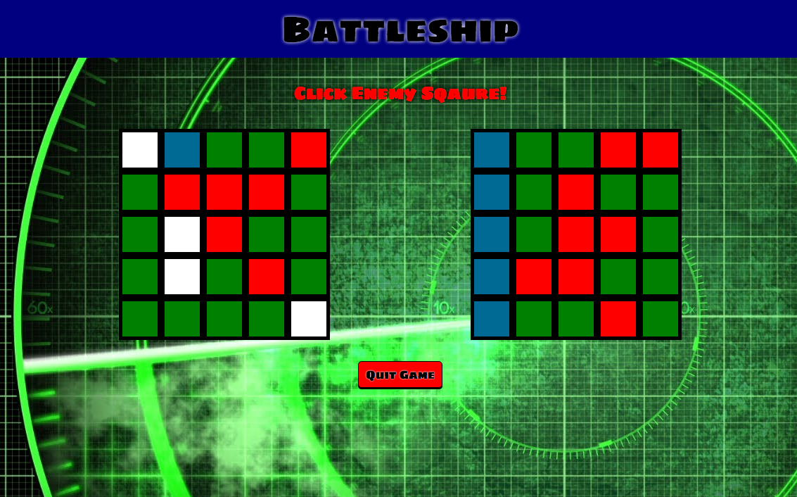

# BattleShip!

[BattleShip Live][heroku]

[heroku]: http://bvbattleship.herokuapp.com

A BattleShip for all ages. Batlleship is a full-stack web application. It implements
a Ruby on Rails backend, a PostgreSQL database, and React.js with a Flux architectural
framework on the frontend.

## Instructions
Just sign in to start a game, and be ready
to take on the all-powerful computer. Simply place your 10 ships on
your board by click the squares, and then guess away. The first player to "hit"
all 10 ships wins.
